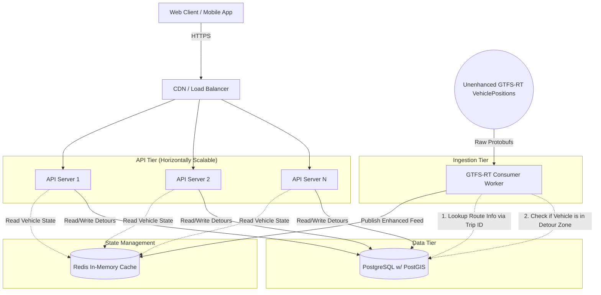

# Production Architecture Design

This document outlines the envisioned production architecture for Route Resilience. It transitions the application from a local deployment to a horizontally scalable, high-throughput microservices architecture.

## Overview

The primary goal of this architecture is to act as a **GTFS-RT Enhancement Middleware**. It sits between the transit agency's raw feeds and the downstream consumers (like Google Maps, Apple Maps, or the Transit App).

The system decouples two fundamentally different workloads:
1. **The GTFS-RT Ingestion Service:** A continuous background process that polls the transit agency's basic, "unenhanced" real-time vehicle positions, applies our internal detour logic and trip modifications, and builds an enhanced GTFS-RT dataset.
2. **The API Server (Admin & Internal UI):** An I/O-bound web server dedicated to serving the React web app for internal transit staff to manage detours, while pumping the enhanced binary Protobuf feed to an internal datastore (leaving wide-scale public distribution out of scope).

---

## Architecture Diagram

---

## Core Components

### 1. Data Tier: PostgreSQL + PostGIS
**Replaces:** Embedded `better-sqlite3`

In production, GTFS data (routes, stops, shapes) and dynamic data (detours, cancellations) are housed in a managed PostgreSQL database. 
- **Why PostGIS?** The PostGIS extension provides native geospatial functions (like `ST_Distance` and `ST_LineLocatePoint`). Instead of manually iterating through shape arrays in Node.js to find the closest detour diverge point, the database computes this instantly at the C-level.
- **Why Postgres?** It safely handles concurrent read/write locks, meaning multiple API servers can create detours simultaneously without locking the database.

> [!TIP]
> **Alternative:** If sticking strictly to SQLite is preferred for cost/simplicity, a distributed edge database like **Turso (libSQL)** could be substituted here, though you lose PostGIS capabilities.

### 2. State Management: Redis
**New Component**

Redis acts as the blazing-fast connective tissue between the GTFS-RT Ingestion Service and the API Servers.
- **The Workflow:** The Ingestion Worker constantly consumes the "unenhanced" GTFS-RT VehiclePositions feed, maps the raw vehicle positions to any active detours, and pushes the new *enhanced* GTFS-RT binary payload to Redis.
- **API Reads:** The internal API server fetches the current enhanced state directly from Redis to power the Admin UI map. (Note: Wide-scale distribution of this Redis payload to external consumers is assumed to be handled by downstream infrastructure outside the scope of this project).

### 3. Ingestion Tier: GTFS-RT Consumer Worker
**Replaces:** Integrated `engine.ts` Simulation loop

The real-time data consumer is extracted into its own dedicated Node.js (or Go/Rust) worker process. 
- It handles downloading and decoding the binary Protobuf feeds from the transit agency.
- It calculates if real vehicles have entered our custom detour paths and updates their states accordingly.
- It pushes cleaned, processed data to Redis.

> [!CAUTION]
> **Single Source of Truth:** You generally only want *one* primary Ingestion Worker hitting the transit agency's API to prevent IP rate-limiting and race conditions. If high availability is required, a primary/replica leader election pattern should be used.

> [!TIP]
> **Plug-and-Play Modularity:** The core codebase is built around a generic `VehicleDataSource` interface. This means the engine is entirely agnostic to *where* the vehicle data comes from. You can seamlessly swap the backend between a local physics simulator, a GTFS-RT Protobuf consumer, or a direct agency AVL (Automatic Vehicle Location) API simply by writing a new class that implements this interface.

### 4. API Tier: Admin Servers
**Replaces:** The monolithic Express app

The API servers become completely stateless and primarily serve the **Admin Dashboard**. Their job is to host the React web app strictly for internal transit staff for managing detours and drawing paths. They rely on Postgres for detour creation and Redis to power the live internal map.

*(Note: While the API can technically serve the enhanced `gtfs-rt.pb` file directly, the complexities of robust public feed distribution to heavy downstream aggregators are considered outside the scope of this core project).*

---

## System Workflows

### 1. Generating the Enhanced Feed
1. The **Ingestion Worker** pulls the "unenhanced" GTFS-RT VehiclePositions feed.
2. It queries Postgres to determine if vehicles have entered active detours.
3. It compiles an **Enhanced GTFS-RT Protobuf** and pushes it to **Redis**.
4. The system's job is complete (downstream distribution logic takes over from here).

### 2. An Admin Creates a Detour
1. Admin submits a detour shape and start/end stops.
2. The **API Server** uses PostGIS in **Postgres** to validate the diverge/rejoin points on the original route.
3. The detour is saved to **Postgres**.
4. The API Server publishes an event (e.g., via Redis Pub/Sub) notifying the **Ingestion Worker**.
5. The **Ingestion Worker** applies the new detour logic to the next incoming batch of real-time vehicle positions.

---

## Future Scaling Considerations

> [!IMPORTANT]
> **CDN / Edge Caching for Protobufs**
> Since the goal is strictly to pump out a static, enhanced GTFS-RT feed, the ultimate scaling trick is to place a CDN (like Cloudflare) in front of the API servers. If the Ingestion Worker updates Redis every 15 seconds, the API server can set a `Cache-Control: max-age=15` header on the Protobuf response. The CDN will cache the feed at the edge, meaning downstream consumers hit the CDN instead of your Node servers, reducing your backend API load to almost zero.
