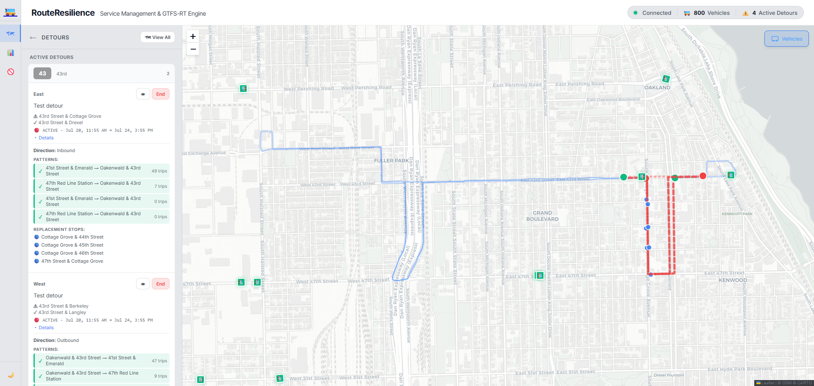
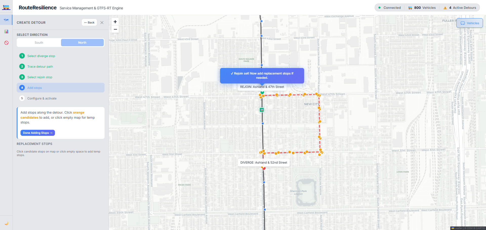
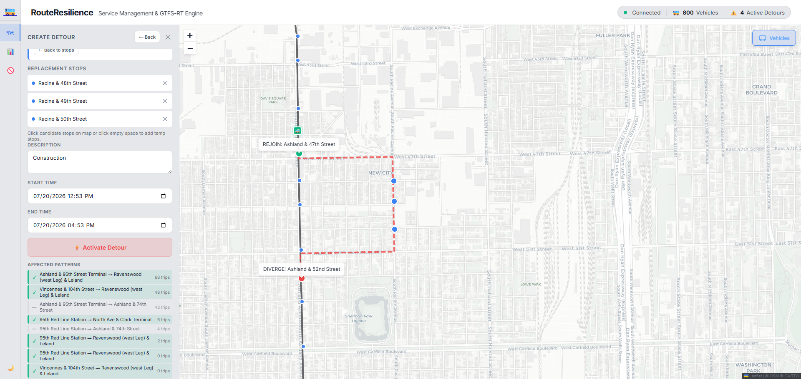
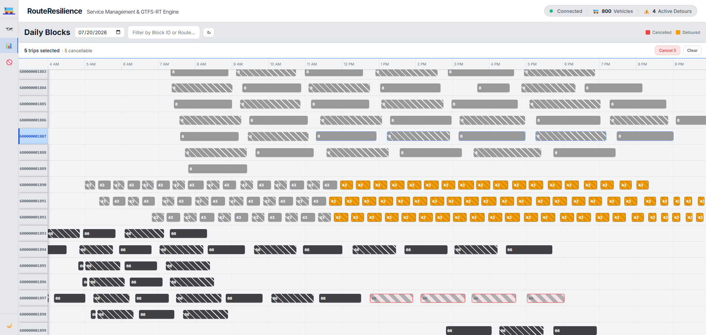
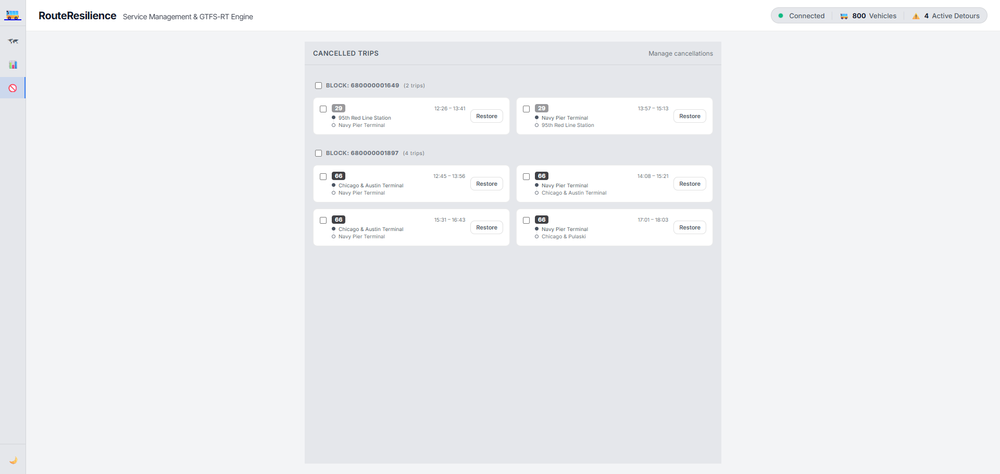

# RouteResilience

**Service Management & GTFS-RT Engine**

A specialized dashboard and visualization tool built for transit agencies to manage, plan, and visualize route detours and disruptions.  

Ingests GTFS schedule and geographic data in conjunction with vehicle location feed to provide a real-time, map-based interface for operations teams to dynamically reroute buses and manage stop closures.

## Features

- **Interactive Map Visualization**: Powered by Leaflet, displaying full route shapes, stops, and active vehicle positions.
- **Detour Creation Workflow**: Intuitive point-and-click interface to define diverge/rejoin stops, featuring an automatic **snap-to-street** routing workflow that calculates temporary paths using OSRM.
- **Block Viewer (Run Management)**: Visualize bus blocks/runs on a Gantt-style timeline to understand vehicle assignments, with the ability to dynamically **cancel specific trips, entire blocks, or runs**.
- **Cancelled Trip Tracking**: Manage and visualize cancelled trips with impact analysis against the schedule.
- **Advanced GTFS Processing**: Automatically detects, groups, and maps all unique trip patterns and route variants within the schedule data.
- **GTFS-RT Middleware Proxy**: Automatically generates a live, valid protobuf GTFS-RT feed (`/api/gtfs-rt`) containing `VehiclePositions`, `TripUpdates` (predictions), and experimental `TripModifications` to broadcast detours downstream to riders.
- **Dynamic Routing**: Automatic map route updates utilizing OSRM to find the most logical temporary path between two transit stops.
- **Dark/Light Mode**: Fully responsive, accessible interface with theming support for day/night operations.

## Screenshots

### Map View

*Visualizing a detour with temporary replacement stops and the OSRM-calculated path.*

#### Intuitive Detour Planning ####

*Use snap-to-street tracing and auto-detect pre-existing stops along detour path*


*Configurable start and end date-times for detours, with RouteResilience automatically detecting route patterns and trips affected by detour.*

### Block Viewer (Gantt Chart)

*Analyzing runs throughout the day alongside cancelled/detoured trips.*

### Block Viewer (Gantt Chart)

*View and restore cancelled trips.*

## Technology Stack

- **Frontend**: Vite, TypeScript, Leaflet (Mapping), Vanilla CSS (Custom Design System)
- **Backend**: Node.js, Express, TypeScript
- **Database**: SQLite3 (for fast, local GTFS querying)
- **Routing**: OSRM (Open Source Routing Machine) API
- **Data Ingestion**: node-gtfs (Parses CTA static GTFS feeds)

## Future Enhancements

### 1. GTFS-RT Ingestion & Middleware Proxy
Currently, RouteResilience runs a high-performance, internal simulation engine to generate thousands of realistic vehicle positions based on the static schedule. 

In a true production environment, the ultimate model is to configure RouteResilience as a **GTFS-RT Middleware Proxy**. Instead of simulating vehicles, the system will ingest the transit agency's raw, upstream GTFS-RT `VehiclePositions` feed. The application will correlate real buses to the static schedule, seamlessly overlay the user-created detours (`TripModifications`), and emit an enhanced, corrected GTFS-RT feed downstream to platforms like Google Maps and Apple Maps.

### 2. Service Management & Headway Adherence
As a GTFS-RT middleware proxy with real-time knowledge of bus locations and the static schedule, RouteResilience is perfectly positioned to monitor **schedule adherence and headways**. 

Future updates will include an automated engine that continuously scans the live network to identify "bunched" or "gapped" buses. Following a set of configurable agency rules, the system will actively recommend service restoration interventions (such as holding a bus at a control point or expressing a bus to fill a gap) to improve headway reliability and keep the network flowing.

## Local Development Setup

1. **Clone the repository**
2. **Install dependencies**
   ```bash
   npm install
   ```
3. **Start the development environment**
   This will concurrently start the Vite frontend and the Express backend. On the first run, it will automatically download and parse the GTFS dataset into a local SQLite database (this may take a few minutes).
   ```bash
   npm run dev
   ```
4. **Access the Application**
   Open your browser and navigate to `http://localhost:5173`.

## Deployment (Render / VPS)

Because this application relies on a local SQLite database populated by a large GTFS download on startup, deploying to traditional serverless environments (like Vercel or Netlify) is not recommended. 

The easiest way to deploy this is using a standard VPS or a persistent service like **Render** or **Railway**.

### Build for Production
To build the frontend client and compile the backend TypeScript:
```bash
npm run build
```

### Start Production Server
```bash
npm start
```
By default, the Express server will serve the static files from `dist/client` and expose the API on port `3001` (or your configured `PORT` environment variable).

## API Endpoints

- `GET /api/status` - Returns database and data freshness status
- `GET /api/routes` - Returns all parsed transit routes
- `GET /api/routes/:id/shape` - Returns the geographic shape of a route
- `GET /api/routes/:id/stops` - Returns all stops for a route
- `GET /api/detours` - Returns all active and scheduled detours
- `POST /api/detours` - Create a new detour
- `GET /api/blocks` - Retrieve block/run assignments for the Gantt viewer
- `GET /api/cancelled` - Retrieve cancelled trips

## License
MIT License
